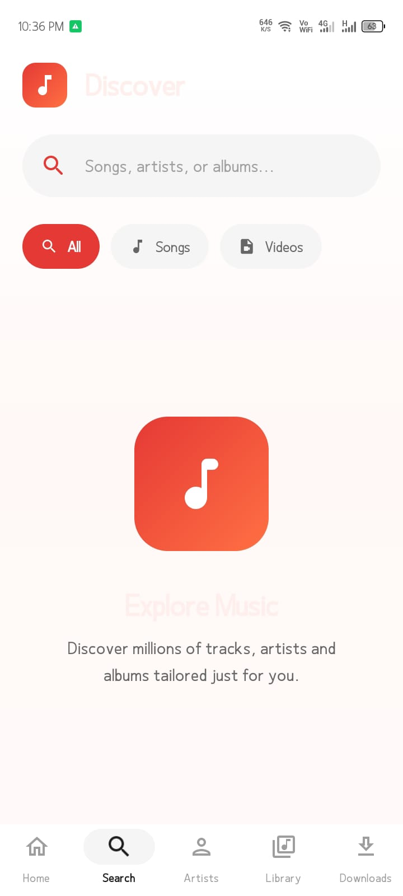
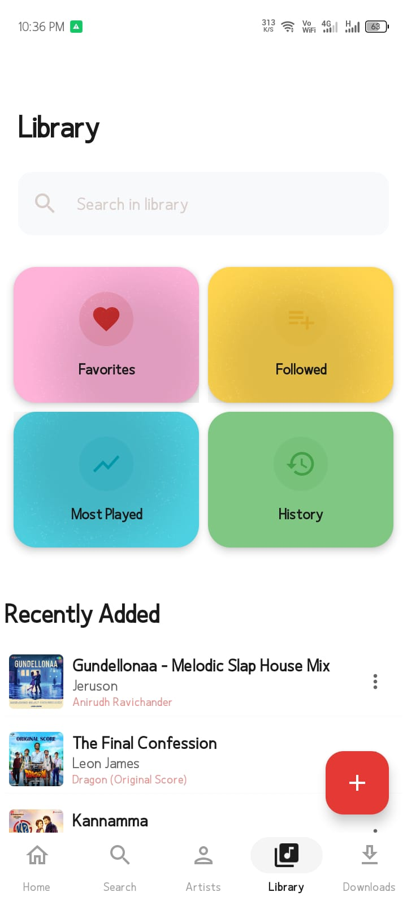
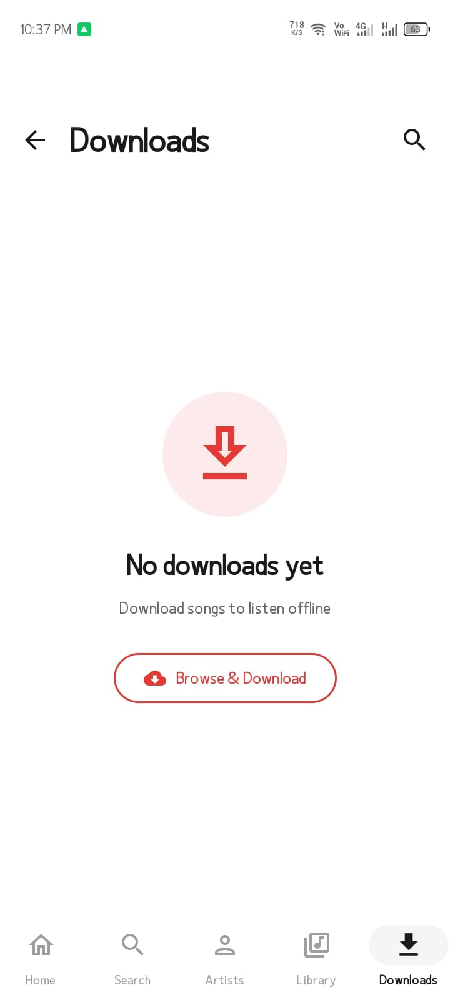

<div align="center">

# 🎵 REON Music

<p align="center">
  
  
  
</p>

**A beautiful, feature-rich Android music streaming app built with Kotlin & Jetpack Compose**

[](https://www.android.com)
[](https://kotlinlang.org)
[](https://developer.android.com/jetpack/compose)
[](LICENSE)

[Download APK](#-download) • [Features](#-features) • [Screenshots](#-screenshots) • [Building](#-building)

</div>

---

## ✨ Features

<table>
<tr>
<td>

### 🎵 **Playback**
- Stream from **JioSaavn** & **YouTube Music**
- Background playback with media controls
- Gapless playback & crossfade
- Queue management with shuffle/repeat
- Sleep timer with fade-out

</td>
<td>

### 📚 **Library**
- Offline downloads
- Playlist management
- Liked songs collection
- Listening history
- Full metadata support

</td>
</tr>
<tr>
<td>

### 🔍 **Search**
- Global search across sources
- Search history
- Filter by type (Songs, Albums, Artists, Playlists)
- Sort options

</td>
<td>

### 🎨 **Personalization**
- 8 beautiful theme presets
- Dynamic colors from album art
- Light, Dark & AMOLED modes
- Custom font families
- Auto-update content

</td>
</tr>
<tr>
<td>

### 🎬 **Video & Lyrics**
- Video playback with PiP
- Quality selection (360p-1080p)
- Synchronized lyrics (LrcLib)
- SponsorBlock integration

</td>
<td>

### 🔒 **Privacy**
- **FOSS** flavor (no tracking)
- **Full** flavor (optional crash reporting)
- Multi-account support
- YouTube Music sync
- Cloud sync via Neon PostgreSQL

</td>
</tr>
</table>

---

## 📸 Screenshots

<p align="center">
  
  &nbsp;&nbsp;
  
  &nbsp;&nbsp;
  
</p>

<p align="center">
  
  &nbsp;&nbsp;
  
  &nbsp;&nbsp;
  
</p>

<p align="center"><i>Home • Search • Now Playing • Library • Downloads • Top Artists</i></p>

---

## 🏗️ Architecture

```
┌─────────────────────────────────────────────────────────────┐
│  📱 UI Layer (Jetpack Compose + Material 3)                  │
├─────────────────────────────────────────────────────────────┤
│  • Home • Search • Library • Player • Settings • Downloads   │
├─────────────────────────────────────────────────────────────┤
│  🎯 Presentation Layer (MVVM)                                │
├─────────────────────────────────────────────────────────────┤
│  • ViewModels • StateFlow • UI State Management              │
├─────────────────────────────────────────────────────────────┤
│  📦 Domain Layer                                             │
├─────────────────────────────────────────────────────────────┤
│  • Use Cases • Repository Interfaces • Models                │
├─────────────────────────────────────────────────────────────┤
│  💾 Data Layer                                               │
├─────────────────────────────────────────────────────────────┤
│  Network (Ktor) • Database (Room) • DataStore (Prefs)        │
└─────────────────────────────────────────────────────────────┘
```

### Tech Stack

| Category | Technology |
|----------|------------|
| **Language** | Kotlin |
| **UI** | Jetpack Compose + Material 3 |
| **Architecture** | MVVM + Clean Architecture |
| **DI** | Hilt |
| **Networking** | Ktor Client |
| **Database** | Room (local) + Neon PostgreSQL (cloud) |
| **Playback** | Media3 (ExoPlayer) |
| **Images** | Coil |
| **Background** | WorkManager |
| **Prefs** | DataStore |

---

## 📋 Requirements

- **Android**: 8.0+ (API 26)
- **Android Studio**: Hedgehog or later
- **JDK**: 17 or OpenJDK 23

---

## 🚀 Building

### Build Flavors

| Flavor | Description |
|--------|-------------|
| `FOSS` | No crash analytics, fully open-source friendly |
| `Full` | Optional Sentry crash reporting (user consent) |

```bash
# Build FOSS debug APK
./gradlew assembleFossDebug

# Build Full debug APK (default)
./gradlew assembleFullDebug

# Build release APK
./gradlew assembleFullRelease
```

### Configuration

Create `local.properties` in project root:

```properties
sdk.dir=YOUR_ANDROID_SDK_PATH
```

---

## 📥 Download

Get the latest APK from the releases section (when available).

> **Note**: This is a proprietary project. Distribution is restricted.

---

## 🎨 Theme System

REON Music features a comprehensive theming system:

- **8 Theme Presets**: Classic Green, Ocean Blue, Sunset Orange, Purple Haze, Rose Gold, Forest Green, Midnight Black, Crimson Red
- **Dynamic Colors**: Extracted from album artwork
- **Font Customization**: 8 font families with 4 size options
- **Display Modes**: Light, Dark, AMOLED (pure black)

---

## 🌐 API Integrations

- **JioSaavn API** - Music streaming
- **YouTube InnerTube** - YouTube Music streaming
- **LrcLib** - Synchronized lyrics
- **SponsorBlock** - Skip non-music segments
- **Return YouTube Dislike** - View like/dislike ratios
- **Neon PostgreSQL** - Cloud sync

---

## ⚖️ Legal Notice

### Clean-Room Implementation

This project is an **original, clean-room implementation**. No GPL-licensed code has been copied. All code is independently written based on:

- Publicly documented Android APIs (Jetpack, Media3, Room, Hilt)
- Standard cryptographic algorithms available in Java SDK
- Publicly observable API behavior patterns

### Third-Party Licenses

All dependencies use permissive licenses (Apache 2.0, MIT):
- Jetpack Compose, Media3, Room, Hilt - Apache 2.0
- Ktor - Apache 2.0
- Coil - Apache 2.0
- Kotlin Serialization - Apache 2.0

---

## ⚠️ Disclaimer

This app is for **educational purposes** only. Users must:
- Have proper licensing agreements for copyrighted content
- Respect third-party API terms of service
- Not use this app to infringe on copyrights

The developers do not endorse or encourage piracy.

---

<div align="center">

**Built with ❤️ using Kotlin and Jetpack Compose**

*Last Updated: March 2026*

</div>

